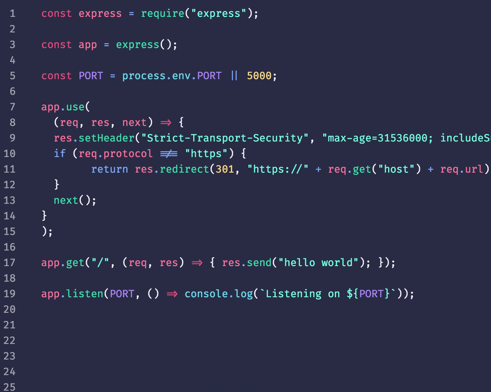
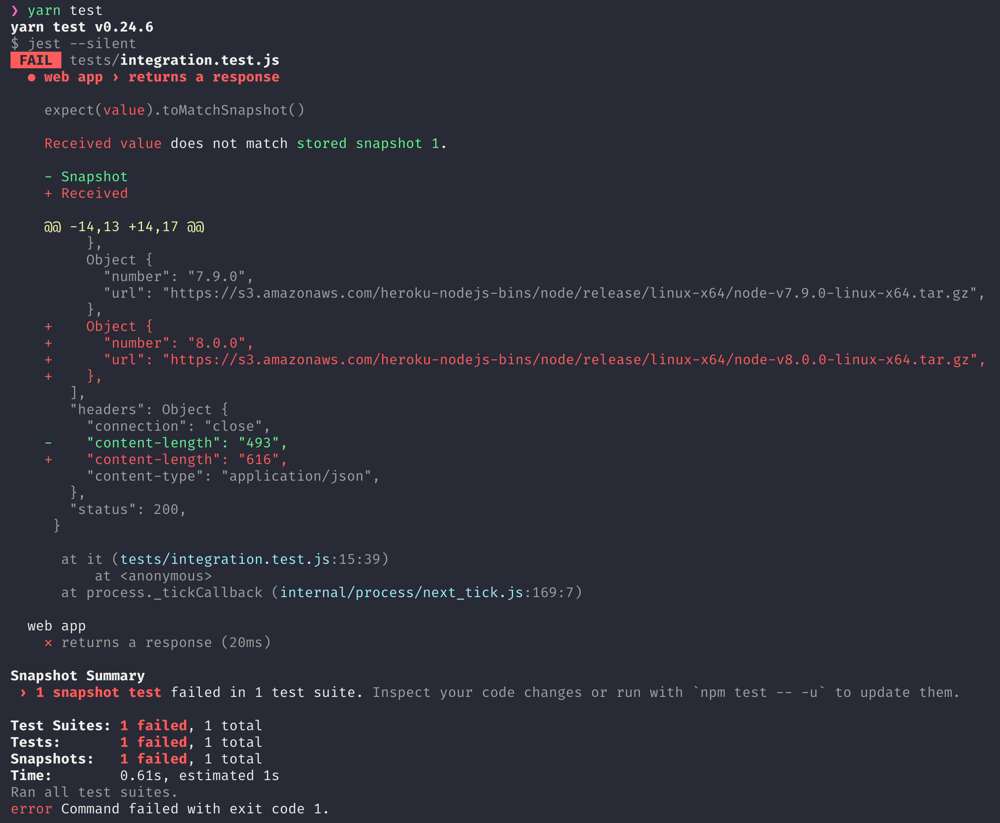

# [译]2017年，一个Node开发者的好习惯

> 原文链接：[Habits of a Happy Node Hacker 2017](https://blog.heroku.com/node-habits-2017)

从我们之前发布的 [Happy Node Hackers](https://blog.heroku.com/node-habits-2016) 算起,已经差不多一年了。尽管时间很短，但却已发生了很多变化，一些强大的新工具已经发布了。 Node.js生态系统持续迭代，已出现了更新的最佳实践。


以下是2017年Node开发者的8个新习惯。它们专门针对应用开发者，而不是模块作者，因为他们有不同的目标和约束:

## 1.锁定你的依赖树

在如今的许多Node应用程序中，你的代码通常只是冰山一角。即便是一个非常小的应用，也可能有数千行的Javascript代码隐藏在node_modules里。如果在package.json中，你的应用指定了确切的依赖项，而这些库可能并不存在。因为随着时间推移，你每次`install`都可能获得不同的代码，从而导致一些不可预期的潜在bug。

在过去的一年中，Facebook 发布了一种新的包管理器[Yarn](https://yarnpkg.com/)。它可以让你使用庞大的npm库中的将近50万个模块，并生成一个锁文件(lockfile)来保存你的依赖树中每个模块的精确版本。这意味我们在每次发布应用时都将下载完全相同的代码。

不过，npm也发布一个带锁文件(lockfile)的新版本。确实，npm现在更快了。这意味着无论你选择哪种包管理器，你都将感受安装时的巨大改进，并且在生产中也会出现更少的错误。

使用`Yarn`时，安装它并运行在你的应用目录下。它将安装你的依赖项并生成一个`yarn.lock`文件，在编译你的应用时，它会告诉`Heroku`使用`Yarn`进行编译。

使用`npm 5`时，在本地运行`npm install -g npm@latest`命令进行升级，运行`rm -rf node_modules && npm install`命令重新安装你的应用依赖包。生成的`package-lock.json`文件会告诉`Heroku `去使用`npm 5`来安装你的模块。

## 2.钩起来

自动化构建中[scripts](https://docs.npmjs.com/misc/scripts)提供很多好用的钩子。如果你想在编译你的应用之前运行一些东西，你可以使用`preinstall`脚本。需要使用grunt, gulp, browserify, 或者 webpack 来构建assets吗? 在`postinstall`中完成它吧。

在`package.json`中：
```javascript
    "scripts":{
        "postinstall":"grunt build",
        "start":"node app.js"
    }
```
你也可以使用环境变量去控制这些脚本：
```javascript
    "postinstall": "if $BUILD_ASSETS; then npm run build-assets; fi",
    "build-assets": "grunt build"
```
如果你的脚本需要一些外部的支持，可以移到sh之类文件里：
```javascript
    "postinstall": "scripts/postinstall.sh"
```

## 3.现代化你的Javascript

随着Node 8的发布，在ES2015中维护一个复杂的构建系统来编写我们的应用程序的日子已经过去了。Node现在已经有99%的特性与ES2015规范一起完成了，这意味着你可以使用这些新的特性，例如 [模板字符串](https://developer.mozilla.org/en/docs/Web/JavaScript/Reference/Template_literals) 或者[解构赋值](https://developer.mozilla.org/en/docs/Web/JavaScript/Reference/Operators/Destructuring_assignment), 而不需要任何的转换或者构建过程。
```javascript
    const combinations = [
        { number: "8.0.0", platform: "linux-x64" },
        { number: "8.0.0", platform: "darwin-x64" },
        { number: "7.9.0", platform: "linux-x64" },
        { number: "7.9.0", platform: "darwin-x64" }
    ];

    for (let { number, platform } of combinations) {
        console.log(`node-v${number}-${platform}.tar.gz`);
    }
```

还有许多这样的[语法糖](https://github.com/lukehoban/es6features)，总之，这些显著提高了JavaScript的可读性，并使代码更具表达性。

## 4.保持你的Promises

除了ES2015，Node 8还支持期待已久的`async`和``await`关键字，而不再是实验特性。这个特性建立在`Promises`的基础之上，允许你编写看起来像同步代码的异步代码，并且具有相同的错误处理语义，使编写更容易、更容易理解和更安全。

你可能需要重新以下编写嵌套的回调代码:
```javascript
    function getPhotos(fn) {
        getUsers((err, users) => {
            if (err) return fn(err);
            getAlbums(users, (err, albums) => {
            if (err) return fn(err);
            getPhotosForAlbums(albums, (err, photos) => {
                if (err) return fn(err);
                fn(null, photos);
            });
            });
        });
    }
```
改变成自上而下而不是由内到外的代码:
```javascript
    async function getPhotos() {
        const users = await getUsers();
        const albums = await getAlbums(users);
        return getPhotosForAlbums(albums);
    }
```

你可以在任何回调中调用`await`。如果你有仍然期望回调的函数，Node 8实现了`util.promisify`，它可以自动将一个用回调风格编写的函数转换为一个`await`可以使用的函数。

## 5.使用Prettier自动格式化你的代码

我们都花了太多的时间来格式化代码，在这里添加一个空格，在那里调整注释，我们都做的和我们的同事的两张桌子有一点不同。这就引出了无休止的争论，关于分号的位置，或者我们是否应该使用分号。[Prettier](http://jlongster.com/A-Prettier-Formatter)是一个开源工具，它承诺最终消除那些无意义的争论。你可以以任何你喜欢的样式编写代码，并且使用一个命令，它的格式都是一致的。



这听起来像是一件小事，但让你自己从空格中解脱出来，很快就会让人感到解脱。Prettier是几个月前才发布的，但它已经被Babel、React、Khan Academy、Bloomberg以及更多的人所接受。

如果你讨厌写分号，让Prettier帮你添加，或者你的整个团队可以用`--no-semi`选项永远把它们驱逐出去。Prettier支持ES2015和Flow语法，而最近的1.4.0版本也增加了对CSS和TypeScript的支持。

它可以集成到大部分的文本编辑器，但是我们建议将其设置成`pre-commit`的钩子或放在package.json的生命周期脚本里:
```javascript
    "scripts": {
        "prettify": "prettier --write 'src/**/*.js'"
    }
```

## 6. 持续测试

推出一个新功能，却发现破坏了生产应用程序，这是非常不爽的。如果你很勤奋地为你编写的代码编写测试，那么你可以避免这种错误，但是编写一个好的测试套件需要花费大量的时间。此外，该功能需要在昨天发布，而这仅仅是第一个版本。为什么还要编写那些在下周就要重写的测试用例?

在像Mocha或Jest这样的框架中编写单元测试是确保JavaScript代码健壮和设计良好的最好方法之一。然而，有许多代码可能无法判断应该投入多少时间去测试。测试库Jest有一个称为快照测试的特性，它可以帮助你获得对那些无法测试的代码的洞察力和可视性。而不是决定提前判断一个函数调用应有的输出并且编写一个测试用例,Jest会将首次运行的结果保存到一个本地文件中,然后用它与下一次运行的结果进行比较，如果有变化，它将会提醒你。



虽然这并不会告诉你你的代码是否和你写的时候一样，但这确实能让你观察到你在快速移动和开发新功能时，你正在向你的应用中引入哪些变化。当输出更改时，你可以使用一个命令快速更新快照，它们将与你的代码一起被检入你的git历史记录。

```javascript
    it("test /endpoint", async () => {
        const res = await request(`http://0.0.0.0:5000/endpoint`);
        const body = await res.json();
        const { status, headers } = res;
        expect({ status, body, headers }).toMatchSnapshot();
    });
```

[测试demo](https://github.com/heroku-examples/jest-snapshot-testing)

一旦你测试了你的代码，建立一个好的CI工作流是确保它能被测试的一种方法。为了达到这个目的，我们推出了Heroku CI。它构建在Heroku持续交付工作流程中，你永远不会等待队列。[点击这里查看详情](https://www.heroku.com/continuous-integration)！

> 不需要花哨的功能，只想要一个超级简单的测试运行器吗? 检查磁带，以满足你的最低测试需求。

## 7. 戴上你的 Helmet

针对web应用程序的安全性，可以通过一些简单而又重要的配置来锁定你的应用程序去返回正确的HTTP头部。

在生产环境中，一个基于Exrpess的应用可以通过使用`Helmet`，可以使你的程序更完美。`Helmet`是一个快捷的中间件模块，主要通过HTTP头来保护你的应用程序。(PS:原文有点啰嗦，这里概括了一下)

`Helmet`可以帮助你防止跨站脚本攻击，防止点击劫持，等等！只需要几行就可以将基本的安全性添加到现有的express应用程序中:
```javascript
const express = require('express');
const helmet = require('helmet');

const app = express();

app.use(helmet());
```
[阅读更多](https://expressjs.com/en/advanced/best-practice-security.html)

## 8. 请使用HTTPS

通过默认使用私有连接，并使之成为规范，这样每个人都会更安全。作为web工程师，我们没有理由不将应用程序中的所有流量都默认为使用HTTPS。

在express应用程序中，你需要做一些事情来确保你的站点是通过https服务的。首先，确保在响应中设置了`Strict-Transport-Security`请求头部(通常缩写为HSTS)。这指示浏览器总是通过https发送请求。如果你在使用Helmet，那么这已经为你做了！

然后，确保将任何http请求重定向到服务器，通过https连接到相同的url。`express-enforce-ssl `中间件提供了一种简便的方法。

```javascript
const express = require('express');
const expressEnforcesSSL = require('express-enforces-ssl');

const app = express();

app.enable('trust proxy');
app.use(expressEnforcesSSL());
```

此外，你还需要证书机构颁发的TLS证书。但是如果你将应用程序部署到Heroku或者其它专业dyno环境，你将自动得到TLS证书，我们会通过自动化证书管理工具为你的域配置加密,如果你没有一个自己的域名,我们提供一个通用的子域*.herokuapp.com。

## 你的习惯是什么？

我试着在我的所有项目中遵从这些习惯。不管你是 node 新人还是服务端 JS 老手，我确定你会为
自己开发一些技巧。我们非常欢迎听到它们！使用 #node_habits 标签，分享你的习惯！

Happy hacking!